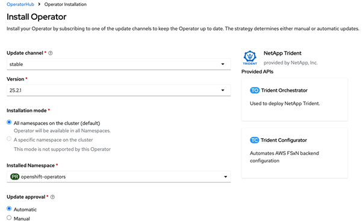

= OpenShift OperatorHubを使用したTridentのインストール
:hardbreaks:
:allow-uri-read: 
:icons: font
:imagesdir: ../media/

[role="lead"]
Red Hat OpenShiftを使用する場合は、Red Hat認定オペレータを使用してNetApp Tridentをインストールできます。Red Hat OpenShift Container PlatformからTridentをインストールするには、次の手順を実行します。

<<Updating screens on this page>>

.作業を開始する前に
インストールを開始する前に、をlink:../trident-get-started/requirements.html["Tridentをインストールするための環境の準備"]参照してください。

== Tridentオペレータの検索とインストール

.手順
. OpenShift OperatorHubに移動し、NetApp Tridentを検索します。
+
image::../media/openshift-operator-01.png[Trident のオペレータ]

. 「 * Install * 」をクリックします。
+
image::../media/openshift-operator-02.png[インストール]

. 必要なオプションを選択し、*[インストール]*をクリックします。
+

. インストールが完了すると、インストールされたオペレータのリストにオペレータが表示されます。
+
image::../media/openshift-operator-04.png[インストール済み]

+
== Tridentオペレーターをアンインストールする

.手順
. インストールされている演算子のリストからTrident演算子を選択します。
. 演算子からすべてのオペランドインスタンスを削除する場合に選択します。
+

WARNING: [この演算子からすべてのオペランドインスタンスを削除する]チェックボックスをオンにしないと、Tridentはアンインストールされません。

. [ アンインストール ] をクリックします。

