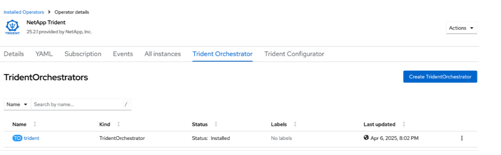

= OpenShift OperatorHubを使用したTridentのインストール
:hardbreaks:
:allow-uri-read: 
:icons: font
:imagesdir: ../media/

[role="lead"]
Red Hat OpenShiftを使用する場合は、Red Hat認定オペレータを使用してNetApp Tridentをインストールできます。Red Hat OpenShift Container PlatformからTridentをインストールするには、次の手順を実行します。

.作業を開始する前に
インストールを開始する前に、をlink:../trident-get-started/requirements.html["Tridentをインストールするための環境の準備"]参照してください。

== Tridentオペレータの検索とインストール

.手順
. OpenShift OperatorHubに移動し、NetApp Tridentを検索します。
+
image::../media/openshift-operator-01.png[Trident のオペレータ]

. * NetApp Trident* をクリックしてインストール設定を開きます。
. 必要なオプションを選択し、「*インストール*」をクリックしてオペレーター構成を開きます。
+
image::../media/openshift-operator-02.png[インストール]

+

NOTE: 必ず最新の Operator バージョンを選択してください。

. すべてのパラメータをそのままにして、[インストール] をクリックします。
+
image::../media/openshift-operator-03.png[インストール]

+
インストールが完了すると、インストールされたオペレーターのリストにオペレーターが表示され、使用できるようになります。

. オペレーターの詳細を表示するには、「*オペレーターの表示*」をクリックします。
+
image::../media/openshift-operator-04.png[インストール済み]

. * Trident Orchestrator* の下で、*インスタンスの作成* をクリックします。
+
image::../media/openshift-operator-07.png[インストール済み]

. *YAML ビュー* をクリックし、次の内容をフォームに貼り付けます。
+
[source, yaml]
----
apiVersion: trident.netapp.io/v1
kind: TridentOrchestrator
metadata:
  name: trident
  namespace: openshift-operators
spec:
  IPv6: false
  debug: false
  nodePrep:
  - iscsi
  imageRegistry: ''
  k8sTimeout: 30
  namespace: trident
  silenceAutosupport: false
----
+
[]
====
** Red Hat Enterprise Linux CoreOS (RHCOS) では iSCSI が有効化および構成されていません。
** 追加できるのは `nodePrep`すべての OpenShift ワーカー ノードで iSCSI サービスとマルチパス サービスの両方を設定および有効にするパラメーター。
** OpenShift 4.19 以降、この機能でサポートされるTrident の最小バージョンは 25.06.1 です。

====
. *作成*をクリックすると、 Trident Orchestrator が完全にインストールされます。
+

== Tridentオペレーターをアンインストールする

.手順
. インストールされている演算子のリストからTrident演算子を選択します。
. 演算子からすべてのオペランドインスタンスを削除する場合に選択します。
+

WARNING: [この演算子からすべてのオペランドインスタンスを削除する]チェックボックスをオンにしないと、Tridentはアンインストールされません。

. [ アンインストール ] をクリックします。

