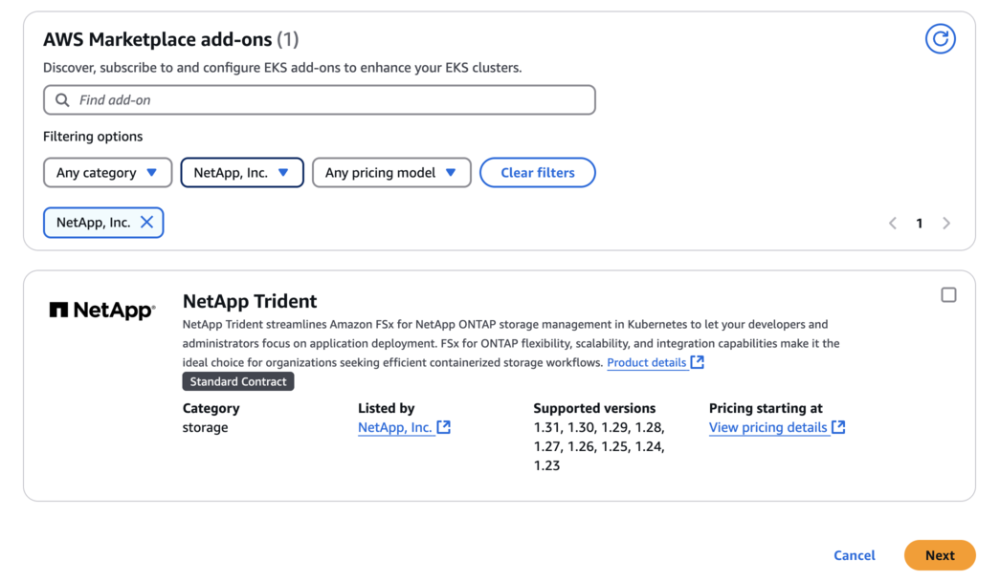

= EKSクラスタでのTrident EKSアドオンの設定
:hardbreaks:
:allow-uri-read: 
:icons: font
:imagesdir: ../media/

[role="lead"]
NetApp Tridentは、KubernetesでAmazon FSx for NetApp ONTAPストレージ管理を合理化し、開発者や管理者がアプリケーションの導入に集中できるようにします。NetApp Trident EKSアドオンには、最新のセキュリティパッチ、バグ修正が含まれており、AWSによってAmazon EKSと連携することが検証されています。EKSアドオンを使用すると、Amazon EKSクラスタの安全性と安定性を一貫して確保し、アドオンのインストール、構成、更新に必要な作業量を削減できます。

== 前提条件

AWS EKS用のTridentアドオンを設定する前に、次の条件を満たしていることを確認してください。

* アドオンを使用する権限を持つAmazon EKSクラスタアカウント。を参照してください link:https://docs.aws.amazon.com/eks/latest/userguide/eks-add-ons.html["Amazon EKSアドオン"^]。
* AWS MarketplaceへのAWS権限：
`"aws-marketplace:ViewSubscriptions",
"aws-marketplace:Subscribe",
"aws-marketplace:Unsubscribe`
* AMIタイプ：Amazon Linux 2（AL2_x86_64）またはAmazon Linux 2 Arm（AL2_ARM_64）
* ノードタイプ：AMDまたはARM
* 既存のAmazon FSx for NetApp ONTAPファイルシステム

== 手順

. EKSポッドがAWSリソースにアクセスできるようにするために、IAMロールとAWSシークレットを作成してください。手順については、を参照してくださいlink:../trident-use/trident-fsx-iam-role.html["IAMロールとAWS Secretを作成する"^]。
. EKS Kubernetesクラスタで、*[アドオン]*タブに移動します。
+
image::../media/aws-eks-01.png[AWS EKS 01]

. [AWS Marketplace add-ons]*にアクセスし、_storage_categoryを選択します。
+

. NetApp Trident *を探し、Tridentアドオンのチェックボックスを選択して* Next *をクリックします。
. 必要なアドオンのバージョンを選択します。
+
image::../media/aws-eks-03.png[AWS EKS 03]

. ノードから継承するIAMロールオプションを選択します。
+
image::../media/aws-eks-04.png[AWS EKS 04]

. アドオン構成スキーマ*に従い、* Configuration Values *セクションのConfiguration Valuesパラメーターを前の手順で作成したrole-arnに設定します（手順1）。
+
値は次の形式で指定する必要があります `eks.amazonaws.com/role-arn: arn:aws:iam::464262061435:role/AmazonEKS_FSXN_CSI_DriverRole`。

+

NOTE: [Conflict resolution method]で[Override]を選択すると、既存のアドオンの1つ以上の設定をAmazon EKSアドオン設定で上書きできます。このオプションを有効にしない場合、既存の設定と競合すると、操作は失敗します。表示されたエラーメッセージを使用して、競合のトラブルシューティングを行うことができます。このオプションを選択する前に、Amazon EKSアドオンが自己管理に必要な設定を管理していないことを確認してください。

+
image::../media/aws-eks-06.png[AWS EKS 06]

. 「 * Create * 」を選択します。
. アドオンのステータスが_Active_であることを確認します。
+
image::../media/aws-eks-05.png[AWS EKS 05]

. 次のコマンドを実行して、Tridentがクラスタに正しくインストールされていることを確認します。
+
[listing]
----
kubectl get pods -n trident
----
. セットアップを続行し、ストレージバックエンドを設定します。詳細については、を参照してください link:../trident-use/trident-fsx-storage-backend.html["ストレージバックエンドの設定"^]。

== CLIを使用したTrident EKSアドオンのインストールとアンインストール

.CLIを使用してNetApp Trident EKSアドオンをインストールします。
次のコマンド例では、Trident EKSアドオンをインストールします（専用バージョンを使用）。
`eksctl create addon --cluster clusterName --name netapp_trident-operator --version v24.10.0-eksbuild.1`

.CLIを使用してNetApp Trident EKSアドオンをアンインストールします。
次のコマンドは、Trident EKSアドオンをアンインストールします。

[listing]
----
eksctl delete addon --cluster K8s-arm --name netapp_trident-operator
----