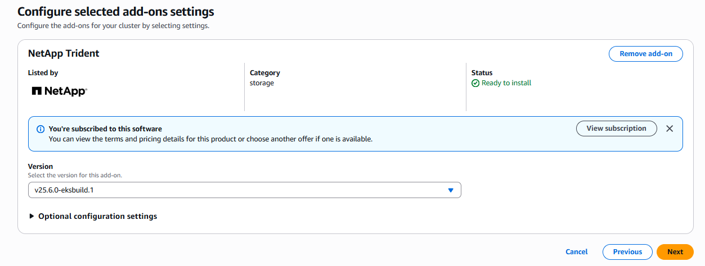

= EKSクラスタでのAstra Trident EKSアドオンの設定
:hardbreaks:
:allow-uri-read: 
:icons: font
:imagesdir: ../media/

[role="lead"]
Astra Tridentは、KubernetesでのAmazon FSx for NetApp ONTAPストレージ管理を合理化し、開発者や管理者がアプリケーションの導入に集中できるようにします。Astra Trident EKSアドオンには、最新のセキュリティパッチ、バグ修正が含まれており、AWSによってAmazon EKSとの連携が検証されています。EKSアドオンを使用すると、Amazon EKSクラスタの安全性と安定性を一貫して確保し、アドオンのインストール、構成、更新に必要な作業量を削減できます。

== 前提条件

AWS EKS用のAstra Tridentアドオンを設定する前に、次の条件を満たしていることを確認してください。

* アドオンサブスクリプションがあるAmazon EKSクラスタアカウント
* AWS MarketplaceへのAWS権限：
`"aws-marketplace:ViewSubscriptions",
"aws-marketplace:Subscribe",
"aws-marketplace:Unsubscribe`
* AMIタイプ：Amazon Linux 2（AL2_x86_64）またはAmazon Linux 2 Arm（AL2_ARM_64）
* ノードタイプ：AMDまたはARM
* 既存のAmazon FSx for NetApp ONTAPファイルシステム

== 手順

. EKS Kubernetesクラスタで、*アドオン*タブに移動します。
+
image::../media/aws-eks-01.png[AWS EKS 01]

. [AWS Marketplace add-ons]*にアクセスし、_storage_categoryを選択します。
+
image::../media/aws-eks-02.png[AWS EKS 02]

. NetApp Trident *を探し、Astra Tridentアドオンのチェックボックスを選択します。
. 必要なアドオンのバージョンを選択します。
+

. ノードから継承するIAMロールオプションを選択します。
+
image::../media/aws-eks-04.png[AWS EKS 04]

. *オプションの構成設定*を展開し、*アドオン構成スキーマ*に従って、*構成値*セクションのconfigurationValuesパラメーターを前の手順で作成したrole-arnに設定します（値は次の形式にする必要があります `eks.amazonaws.com/role-arn: arn:aws:iam::464262061435:role/AmazonEKS_FSXN_CSI_DriverRole`）。[Conflict resolution method]で[Override]を選択すると、既存のアドオンの1つ以上の設定をAmazon EKSアドオン設定で上書きできます。このオプションを有効にしない場合、既存の設定と競合すると、操作は失敗します。表示されたエラーメッセージを使用して、競合のトラブルシューティングを行うことができます。このオプションを選択する前に、Amazon EKSアドオンが自己管理に必要な設定を管理していないことを確認してください。
+
image::../media/aws-eks-06.png[AWS EKS 06]

. 「 * Create * 」を選択します。
. アドオンのステータスが_Active_であることを確認します。
+
image::../media/aws-eks-05.png[AWS EKS 05]

== CLIを使用したAstra Trident EKSアドオンのインストールとアンインストール

.CLIを使用してAstra Trident EKSアドオンをインストールします。
次のコマンド例は、Astra Trident EKSアドオンをインストールします（専用バージョンを使用）。
`eksctl create addon --cluster K8s-arm --name netapp_trident-operator --version v24.10.0-eksbuild`
`eksctl create addon --cluster clusterName --name netapp_trident-operator --version v24.10.0-eksbuild.1`

.CLIを使用してAstra Trident EKSアドオンをアンインストールします。
次のコマンドは、Astra Trident EKSアドオンをアンインストールします。
`eksctl delete addon --cluster K8s-arm --name netapp_trident-operator`
